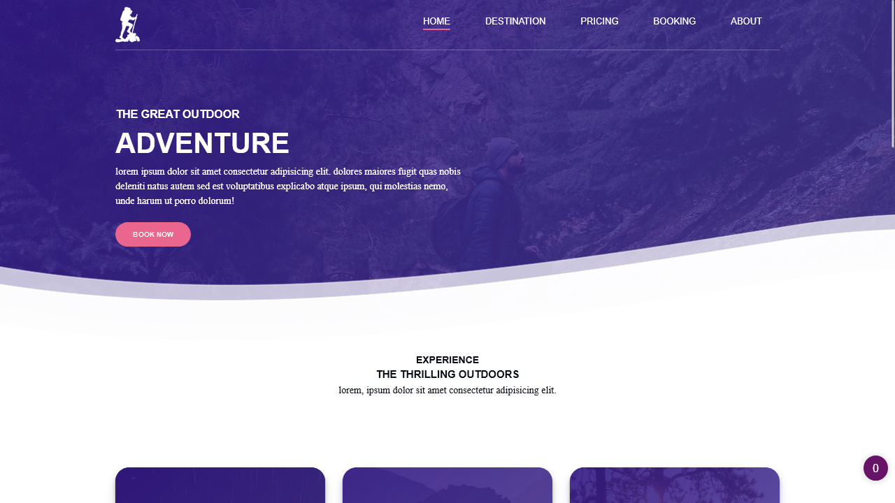

# outdoor-landing-page

A responsive outdoor landing page following [Julio Codes](https://github.com/jlop007)'s video

## Screenshots

## Features

- Top navbar fully responsive implementend with basic Javascript
- Smooth transitions with shadows to buttons and cards section
- Better looking footer

## 🔗 Links

